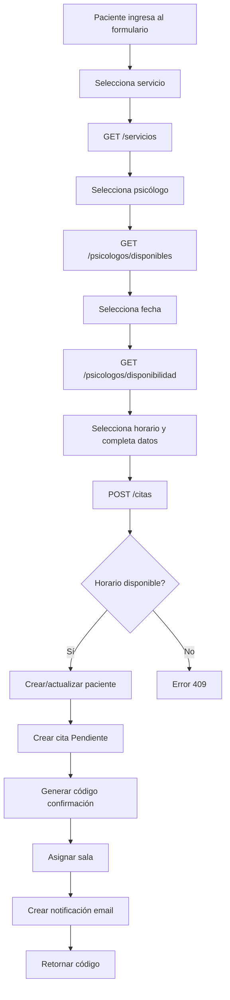
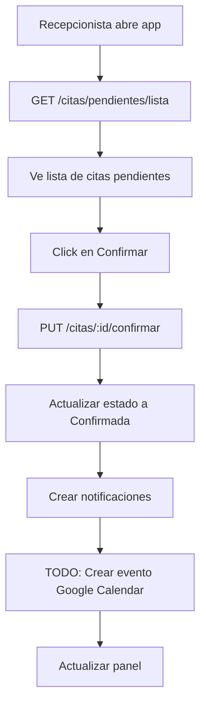
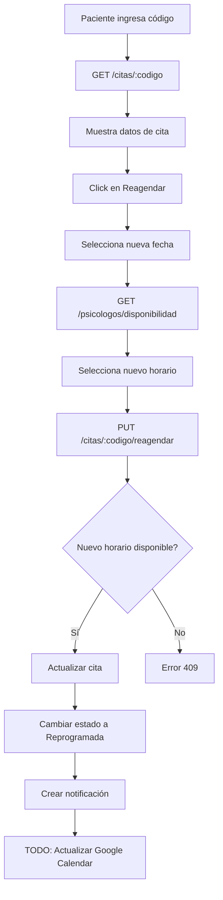

# Sistema de Reservas - API Documentation
## SIGC (Sistema Integral de Gestión de Citas) - Conectemos Chile

---

## 🎯 Descripción General

API REST completa para el sistema de reservas de citas psicológicas de Conectemos Chile. Permite a pacientes agendar, reagendar y cancelar citas online, y a recepcionistas confirmar estas citas desde una aplicación de escritorio.

**Base URL:** `/api/v1`

---

## 📋 Endpoints del Sistema de Reservas

### 1. SERVICIOS

#### `GET /servicios`

**Descripción:** Retorna lista de todos los servicios disponibles de la clínica

**Respuesta exitosa:** `200 OK`
```json
[
  {
    "id_servicio": 1,
    "nombre_servicio": "Terapia Individual",
    "descripcion": "Sesión de terapia psicológica individual",
    "duracion_minutos": 60,
    "precio": 35000.00,
    "tipo_servicio": "terapia",
    "estado": "activo"
  },
  {
    "id_servicio": 2,
    "nombre_servicio": "Terapia de Pareja",
    "descripcion": "Sesión de terapia para parejas",
    "duracion_minutos": 90,
    "precio": 50000.00,
    "tipo_servicio": "terapia",
    "estado": "activo"
  }
]
```

---

### 2. PSICÓLOGOS

#### `GET /psicologos/disponibles`

**Descripción:** Retorna psicólogos que ofrecen una especialidad específica o todos los psicólogos activos

**Parámetros de consulta:**
- `especialidad_id` (int, opcional): ID de la especialidad

**Ejemplo de petición:**
```
GET /api/v1/psicologos/disponibles?especialidad_id=1
```

**Respuesta exitosa:** `200 OK`
```json
[
  {
    "id_psicologo": 1,
    "id_usuario": 5,
    "rut": "12.345.678-9",
    "nombres": "María",
    "apellido_paterno": "González",
    "apellido_materno": "López",
    "fecha_nacimiento": "1985-03-15",
    "telefono": "+56912345678",
    "email_personal": "maria.gonzalez@example.com",
    "registro_profesional": "PSI-12345",
    "titulo_profesional": "Psicóloga Clínica",
    "universidad": "Universidad de Chile",
    "anios_experiencia": 10,
    "estado": "activo",
    "fecha_registro": "2024-01-15T10:30:00"
  }
]
```

---

### 3. DISPONIBILIDAD

#### `GET /psicologos/disponibilidad`

**Descripción:** Calcula y retorna horarios disponibles para un psicólogo en una fecha específica

**Parámetros de consulta (requeridos):**
- `psicologo_id` (int): ID del psicólogo
- `fecha` (date): Fecha en formato YYYY-MM-DD

**Ejemplo de petición:**
```
GET /api/v1/psicologos/disponibilidad?psicologo_id=1&fecha=2024-02-15
```

**Lógica interna:**
1. Consulta tabla `horarios_disponibles` del psicólogo para ese día de semana
2. Genera array de horarios posibles (intervalos de 1 hora)
3. Consulta tabla `citas` para ver horarios ya ocupados en esa fecha
4. Resta ocupados de disponibles

**Respuesta exitosa:** `200 OK`
```json
["09:00", "10:00", "11:00", "14:00", "15:00", "16:00"]
```

**Errores:**
- `404 Not Found`: Psicólogo no encontrado

---

### 4. CREAR CITA (Reserva desde Web)

#### `POST /citas`

**Descripción:** Crea una nueva cita desde el formulario web de pacientes

**Body de la petición:**
```json
{
  "rut": "12.345.678-9",
  "nombres": "Juan Carlos",
  "apellido_paterno": "Pérez",
  "apellido_materno": "Silva",
  "telefono": "+56987654321",
  "email": "juan.perez@example.com",
  "fecha_nacimiento": "1990-05-20",
  "id_servicio": 1,
  "id_psicologo": 1,
  "fecha_cita": "2024-02-15",
  "hora_inicio": "10:00",
  "hora_fin": "11:00",
  "motivo_consulta": "Evaluación inicial por ansiedad"
}
```

**Lógica del sistema:**
1. **Valida disponibilidad** del horario (evitar doble reserva)
2. **Inserta/actualiza paciente** en tabla pacientes
   - Si el RUT ya existe, actualiza los datos
   - Si es nuevo, crea el paciente
3. **Genera código único** de confirmación (8 caracteres UUID)
4. **Asigna sala automáticamente** de las disponibles
5. **Crea cita** con estado "Pendiente" (id_estado_cita = 1)
6. **Crea notificación** de email para el paciente

**Respuesta exitosa:** `200 OK`
```json
{
  "message": "Cita creada exitosamente",
  "codigo_confirmacion": "A3B7C9D2",
  "id_cita": 15,
  "fecha_cita": "2024-02-15",
  "hora_inicio": "10:00"
}
```

**Errores:**
- `409 Conflict`: El horario seleccionado ya no está disponible

---

### 5. BUSCAR CITA POR CÓDIGO

#### `GET /citas/{codigo_confirmacion}`

**Descripción:** Busca y retorna información de una cita por su código de confirmación

**Parámetros de ruta:**
- `codigo_confirmacion` (string): Código único de la cita (ej: "A3B7C9D2")

**Ejemplo de petición:**
```
GET /api/v1/citas/A3B7C9D2
```

**Respuesta exitosa:** `200 OK`
```json
{
  "id_cita": 15,
  "id_paciente": 10,
  "id_psicologo": 1,
  "id_servicio": 1,
  "id_sala": 2,
  "id_estado_cita": 1,
  "fecha_cita": "2024-02-15",
  "hora_inicio": "10:00:00",
  "hora_fin": "11:00:00",
  "motivo_consulta": "Evaluación inicial por ansiedad",
  "observaciones": null,
  "recordatorio_enviado": false,
  "codigo_confirmacion": "A3B7C9D2",
  "google_calendar_event_id": null,
  "fecha_creacion": "2024-01-20T14:30:00",
  "fecha_modificacion": null
}
```

**Errores:**
- `404 Not Found`: No se encontró una cita con ese código de confirmación

---

### 6. REAGENDAR CITA

#### `PUT /citas/{codigo_confirmacion}/reagendar`

**Descripción:** Reagenda una cita existente a una nueva fecha y hora

**Parámetros de ruta:**
- `codigo_confirmacion` (string): Código único de la cita

**Body de la petición:**
```json
{
  "nueva_fecha": "2024-02-20",
  "nueva_hora_inicio": "14:00",
  "nueva_hora_fin": "15:00"
}
```

**Lógica del sistema:**
1. **Busca cita** por código de confirmación
2. **Valida** que la cita no esté cancelada
3. **Verifica nueva disponibilidad** del psicólogo
4. **Actualiza fecha y hora** de la cita
5. **Cambia estado** a "Reprogramada" (id_estado_cita = 4)
6. **Crea notificación** de reagendamiento para el paciente
7. **TODO:** Actualiza evento en Google Calendar (si existe)

**Respuesta exitosa:** `200 OK`
```json
{
  "message": "Cita reagendada exitosamente",
  "codigo_confirmacion": "A3B7C9D2",
  "nueva_fecha": "2024-02-20",
  "nueva_hora_inicio": "14:00"
}
```

**Errores:**
- `404 Not Found`: No se encontró una cita con ese código
- `400 Bad Request`: No se puede reagendar una cita cancelada
- `409 Conflict`: El nuevo horario ya no está disponible

---

### 7. CANCELAR CITA

#### `DELETE /citas/{codigo_confirmacion}/cancelar`

**Descripción:** Cancela una cita existente

**Parámetros de ruta:**
- `codigo_confirmacion` (string): Código único de la cita

**Ejemplo de petición:**
```
DELETE /api/v1/citas/A3B7C9D2/cancelar
```

**Lógica del sistema:**
1. **Busca cita** por código de confirmación
2. **Valida** que no esté ya cancelada
3. **Actualiza estado** a "Cancelada" (id_estado_cita = 5)
4. **Libera horario** (ya no aparecerá como ocupado)
5. **Crea notificación** de cancelación
6. **TODO:** Elimina evento de Google Calendar (si existe)

**Respuesta exitosa:** `200 OK`
```json
{
  "message": "Cita cancelada exitosamente"
}
```

**Errores:**
- `404 Not Found`: No se encontró una cita con ese código
- `400 Bad Request`: La cita ya está cancelada

---

### 8. CONFIRMAR CITA (Recepcionista)

#### `PUT /citas/{id}/confirmar`

**Descripción:** Endpoint para que recepcionista confirme una cita desde la aplicación de escritorio

**Parámetros de ruta:**
- `id` (int): ID interno de la cita

**Ejemplo de petición:**
```
PUT /api/v1/citas/15/confirmar
```

**Lógica del sistema:**
1. **Busca cita** por ID
2. **Valida** que esté en estado "Pendiente"
3. **Actualiza estado** a "Confirmada" (id_estado_cita = 2)
4. **Crea notificaciones** para paciente y psicólogo
5. **TODO:** Crea evento en Google Calendar
6. **TODO:** Guarda `google_calendar_event_id` en la cita

**Respuesta exitosa:** `200 OK`
```json
{
  "message": "Cita confirmada exitosamente",
  "id_cita": 15,
  "estado": "Confirmada"
}
```

**Errores:**
- `404 Not Found`: Cita no encontrada
- `400 Bad Request`: Solo se pueden confirmar citas en estado Pendiente

---

### 9. LISTA DE CITAS PENDIENTES

#### `GET /citas/pendientes/lista`

**Descripción:** Obtiene todas las citas pendientes para el panel de recepción

**Parámetros de consulta:**
- `skip` (int, opcional): Offset para paginación (default: 0)
- `limit` (int, opcional): Límite de resultados (default: 100)

**Ejemplo de petición:**
```
GET /api/v1/citas/pendientes/lista?skip=0&limit=50
```

**Respuesta exitosa:** `200 OK`
```json
{
  "data": [
    {
      "id_cita": 15,
      "id_paciente": 10,
      "id_psicologo": 1,
      "id_servicio": 1,
      "fecha_cita": "2024-02-15",
      "hora_inicio": "10:00:00",
      "hora_fin": "11:00:00",
      "motivo_consulta": "Evaluación inicial",
      "codigo_confirmacion": "A3B7C9D2",
      "fecha_creacion": "2024-01-20T14:30:00"
    }
  ],
  "count": 12
}
```

---

## 🔐 Seguridad y Validaciones

### Prevención de Doble Reserva
- Validación **just-in-time** antes de confirmar la cita
- Verificación de disponibilidad en POST y PUT
- Estados de cita controlados (Pendiente, Confirmada, Cancelada, etc.)

### Códigos de Confirmación
- Generados con UUID (8 caracteres únicos)
- Indexados en base de datos para búsqueda rápida
- Únicos por cita

### Validaciones
- RUT de paciente único
- Horarios dentro de rangos configurados
- Fechas futuras válidas
- Estados de cita válidos

---

## 📊 Estados de Cita

| ID | Nombre | Descripción |
|----|--------|-------------|
| 1 | Pendiente | Cita creada, esperando confirmación de recepción |
| 2 | Confirmada | Cita confirmada por recepcionista |
| 3 | Realizada | Cita completada exitosamente |
| 4 | Reprogramada | Cita que fue reagendada |
| 5 | Cancelada | Cita cancelada (no cuenta como ocupada) |

---

## 📧 Sistema de Notificaciones

Todas las operaciones críticas generan registros en la tabla `notificaciones`:

### Tipos de Notificaciones

1. **confirmacion_inicial**: Enviada al crear la cita (estado Pendiente)
2. **confirmacion_final**: Enviada cuando recepcionista confirma la cita
3. **reagendamiento**: Enviada al reagendar una cita
4. **cancelacion**: Enviada al cancelar una cita
5. **recordatorio**: Enviada 24 horas antes de la cita (TODO: Implementar scheduler)

### Contenido de Email - Ejemplo

**Confirmación Inicial:**
```
Asunto: Solicitud de cita recibida - Conectemos Chile

Hola Juan Carlos,
Hemos recibido tu solicitud de cita.

Código de confirmación: A3B7C9D2
Fecha: 2024-02-15
Hora: 10:00

Estado: Pendiente de confirmación por recepción

Puedes reagendar o cancelar tu cita ingresando tu código en:
https://conectemoschile.cl/mi-cita
```

---

## 🔄 Flujos Completos

### Flujo 1: Paciente Agenda Nueva Cita (Web)



### Flujo 2: Recepcionista Confirma Cita (App Escritorio)



### Flujo 3: Paciente Reagenda Cita (Web)



---

## 📝 TODO - Pendientes de Implementación

### Alta Prioridad
- [ ] **Google Calendar Integration**
  - Crear evento al confirmar cita
  - Actualizar evento al reagendar
  - Eliminar evento al cancelar
  - Guardar `google_calendar_event_id` en BD

- [ ] **Email Worker/Scheduler**
  - Procesar cola de notificaciones
  - Enviar emails automáticamente
  - Reintentos en caso de fallo (max 3)
  - Actualizar estado a "enviada" o "fallida"

- [ ] **Recordatorios Automáticos**
  - Job scheduler (Celery/APScheduler)
  - Enviar recordatorio 24h antes
  - Marcar `recordatorio_enviado = True`

### Media Prioridad
- [ ] **Validación dinámica de estados**
  - Buscar estados por nombre en lugar de hardcodear IDs
  - Crear constantes o enum para estados

- [ ] **Autenticación para recepcionista**
  - JWT para aplicación de escritorio
  - Rol específico para confirmar citas

- [ ] **Logs y auditoría**
  - Registrar todas las operaciones críticas
  - Timestamp de cambios de estado

### Baja Prioridad
- [ ] **Filtros avanzados en lista de citas**
  - Por fecha, paciente, psicólogo, estado
- [ ] **Dashboard estadísticas**
  - Citas por mes, cancelaciones, etc.

---

## 🗄️ Migraciones Necesarias

```sql
-- Ya implementado en models.py, falta crear migración Alembic
ALTER TABLE citas
ADD COLUMN google_calendar_event_id VARCHAR(255);

-- Índice para búsqueda rápida por código
CREATE INDEX idx_citas_codigo ON citas(codigo_confirmacion);

-- Índices para optimización de consultas
CREATE INDEX idx_citas_fecha ON citas(fecha_cita);
CREATE INDEX idx_citas_psicologo_fecha ON citas(id_psicologo, fecha_cita);
CREATE INDEX idx_citas_estado ON citas(id_estado_cita);
```

---

## 🚀 Cómo Usar

### 1. Iniciar el servidor

```bash
cd backend
uvicorn app.main:app --reload
```

### 2. Acceder a la documentación interactiva

- **Swagger UI:** http://localhost:8000/api/v1/docs
- **ReDoc:** http://localhost:8000/api/v1/redoc

### 3. Probar endpoints

Ejemplo con cURL:

```bash
# Obtener servicios
curl http://localhost:8000/api/v1/servicios

# Obtener disponibilidad
curl "http://localhost:8000/api/v1/psicologos/disponibilidad?psicologo_id=1&fecha=2024-02-15"

# Crear cita
curl -X POST http://localhost:8000/api/v1/citas \
  -H "Content-Type: application/json" \
  -d '{
    "rut": "12.345.678-9",
    "nombres": "Juan",
    "apellido_paterno": "Pérez",
    "telefono": "+56987654321",
    "email": "juan@example.com",
    "fecha_nacimiento": "1990-05-20",
    "id_servicio": 1,
    "id_psicologo": 1,
    "fecha_cita": "2024-02-15",
    "hora_inicio": "10:00",
    "hora_fin": "11:00",
    "motivo_consulta": "Evaluación"
  }'
```

---

## 📞 Soporte

Para dudas o reportar problemas:
- GitHub Issues: [repositorio]
- Email: soporte@conectemoschile.cl

---

**Última actualización:** 2024-10-29
**Versión:** 1.0.0
