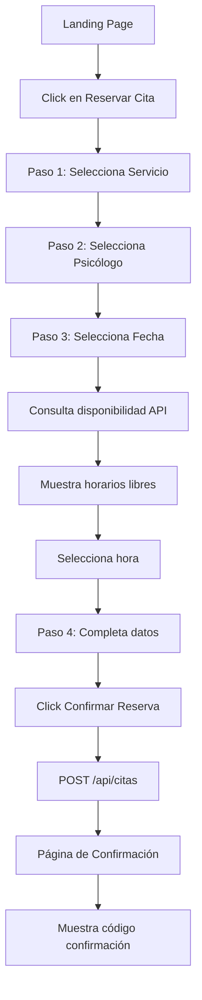
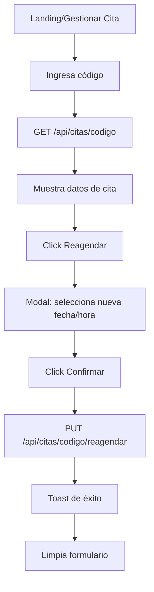
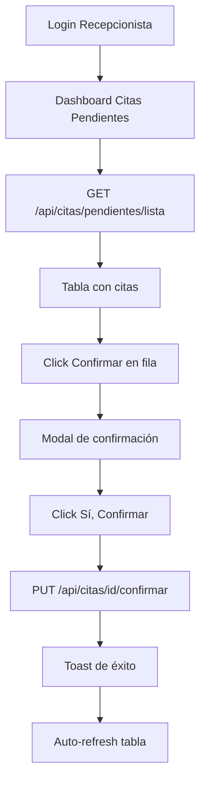

# Sistema de Reservas - Frontend Documentation
## Conectemos Chile - Interfaz de Usuario

---

## 🎨 Descripción General

Sistema completo de reservas implementado en React con TanStack Router y Chakra UI v3. Permite a pacientes reservar, reagendar y cancelar citas, y a recepcionistas gestionar las solicitudes pendientes.

---

## 📁 Estructura de Archivos Creados

### 1. **API Client**
```
frontend/src/client/booking.ts
```
Cliente TypeScript para comunicación con el backend. Incluye:
- Interfaces TypeScript para todos los modelos
- Funciones para todos los endpoints del sistema de reservas
- Manejo de errores y autenticación

### 2. **Páginas Públicas (Para Pacientes)**

#### `/reservar-cita`
```
frontend/src/routes/reservar-cita.tsx
```
**Flujo completo de reserva con stepper de 4 pasos:**

**Paso 1: Seleccionar Servicio**
- Grid de tarjetas con todos los servicios disponibles
- Muestra: nombre, descripción, duración y precio
- Selección visual con borde destacado

**Paso 2: Seleccionar Psicólogo**
- Grid de tarjetas con psicólogos disponibles
- Muestra: nombre, título profesional, años de experiencia
- Filtrado automático por especialidad (si aplica)

**Paso 3: Seleccionar Fecha y Hora**
- Calendario visual de próximos 30 días
- Consulta en tiempo real de disponibilidad del psicólogo
- Grid de horarios disponibles (actualización automática)
- Cálculo automático de hora de fin según duración

**Paso 4: Completar Datos Personales**
- Formulario con validación
- Campos: RUT, nombres, apellidos, teléfono, email, fecha nacimiento
- Campo opcional: motivo de consulta
- Resumen visual de la reserva antes de confirmar

**Características:**
- ✅ Navegación entre pasos (avanzar/retroceder)
- ✅ Validación de datos en cada paso
- ✅ Loading states durante peticiones
- ✅ Mensajes de error descriptivos
- ✅ Diseño responsive

#### `/confirmacion-cita`
```
frontend/src/routes/confirmacion-cita.tsx
```
**Página de confirmación post-reserva:**
- Ícono de éxito grande y visual
- Código de confirmación destacado con opción de copiar
- Información sobre próximos pasos
- Botones para: gestionar cita o volver al inicio
- Recordatorio sobre email enviado

#### `/gestionar-cita`
```
frontend/src/routes/gestionar-cita.tsx
```
**Página para gestionar citas existentes:**

**Sección de Búsqueda:**
- Input para código de confirmación
- Búsqueda en tiempo real
- Validación de código

**Información de Cita:**
- Badge de estado (Pendiente, Confirmada, etc.)
- Fecha y hora de la cita
- Código de confirmación
- Motivo de consulta

**Acciones Disponibles:**
- **Reagendar:** Modal con selector de nueva fecha y hora
- **Cancelar:** Modal de confirmación con advertencia
- Botones deshabilitados si la cita está cancelada o realizada

### 3. **Página Privada (Para Recepcionistas)**

#### `/_layout/citas-pendientes`
```
frontend/src/routes/_layout/citas-pendientes.tsx
```
**Dashboard de recepcionista:**

**Características:**
- Tabla completa de citas pendientes
- Auto-refresh cada 30 segundos
- Contador de citas pendientes
- Botón de actualización manual

**Columnas de la Tabla:**
- Fecha (formato legible)
- Hora (inicio - fin)
- ID Paciente
- ID Psicólogo
- ID Servicio
- Código de confirmación
- Motivo de consulta

**Acciones por Fila:**
- **Confirmar:** Modal de confirmación → cambia estado a "Confirmada"
- **Rechazar:** (Pendiente de implementar)

**Estados de Loading:**
- Spinner durante carga inicial
- Loading en botones durante acciones
- Mensaje si no hay citas pendientes

### 4. **Actualización del Landing**
```
frontend/src/components/Landing/BookingSection.tsx
```
**Modificaciones:**
- ✅ Botón "Reservar Cita Online" → `/reservar-cita`
- ✅ Botón "Gestionar mi Cita" → `/gestionar-cita`
- Botones con iconos y colores distintivos

---

## 🎯 Flujos de Usuario

### Flujo 1: Paciente Reserva una Cita



### Flujo 2: Paciente Reagenda una Cita



### Flujo 3: Recepcionista Confirma Cita



---

## 🛠️ Tecnologías Utilizadas

### Frontend Stack
- **React 18** - UI Library
- **TypeScript** - Type Safety
- **TanStack Router** - Routing
- **TanStack Query** - Data Fetching & Caching
- **Chakra UI v3** - Component Library
- **React Icons** - Iconos

### Características Implementadas

#### 1. **Type Safety Completo**
```typescript
// Todas las interfaces definidas
interface Servicio { ... }
interface Psicologo { ... }
interface ReservaCreate { ... }
interface Cita { ... }
```

#### 2. **React Query para Data Fetching**
```typescript
// Ejemplo
const { data: servicios, isLoading } = useQuery({
  queryKey: ["servicios"],
  queryFn: BookingService.getServicios,
})
```

**Beneficios:**
- ✅ Caché automático
- ✅ Revalidación en background
- ✅ Loading/error states
- ✅ Optimistic updates

#### 3. **Mutations para Acciones**
```typescript
const crearReservaMutation = useMutation({
  mutationFn: BookingService.crearReserva,
  onSuccess: (data) => { /* ... */ },
  onError: (error) => { /* ... */ },
})
```

#### 4. **Navegación Programática**
```typescript
navigate({
  to: "/confirmacion-cita",
  search: { codigo: data.codigo_confirmacion },
})
```

#### 5. **Toast Notifications**
```typescript
toaster.create({
  title: "Éxito",
  description: "Cita creada",
  type: "success",
})
```

---

## 🎨 Componentes UI Destacados

### Stepper (Reserva de Cita)
```tsx
<Stepper index={activeStep} colorScheme="teal" size="lg">
  {steps.map((step, index) => (
    <Step key={index}>
      <StepIndicator>
        <StepStatus
          complete={<StepIcon />}
          incomplete={<StepNumber />}
          active={<StepNumber />}
        />
      </StepIndicator>
      {/* ... */}
    </Step>
  ))}
</Stepper>
```

### Cards Seleccionables
```tsx
<Card.Root
  cursor="pointer"
  onClick={() => handleSelect(item)}
  borderWidth={isSelected ? "2px" : "1px"}
  borderColor={isSelected ? "teal.500" : "gray.200"}
  _hover={{ borderColor: "teal.300", shadow: "md" }}
>
  {/* Contenido */}
</Card.Root>
```

### Diálogos de Confirmación
```tsx
<DialogRoot>
  <DialogTrigger asChild>
    <Button>Cancelar Cita</Button>
  </DialogTrigger>
  <DialogContent>
    <DialogHeader>
      <DialogTitle>¿Estás seguro?</DialogTitle>
    </DialogHeader>
    {/* ... */}
  </DialogContent>
</DialogRoot>
```

---

## 📱 Diseño Responsive

Todos los componentes son completamente responsivos:

```tsx
// Ejemplos
fontSize={{ base: "3xl", md: "4xl", lg: "5xl" }}
columns={{ base: 1, md: 2, lg: 3 }}
py={{ base: 16, md: 24 }}
```

**Breakpoints de Chakra UI:**
- `base`: 0px (móvil)
- `sm`: 480px
- `md`: 768px (tablet)
- `lg`: 992px (desktop)
- `xl`: 1280px
- `2xl`: 1536px

---

## 🔒 Seguridad y Validación

### Frontend
- ✅ Validación de campos requeridos
- ✅ Formato de RUT chileno
- ✅ Validación de email
- ✅ Fechas futuras únicamente
- ✅ Sanitización de inputs

### Backend (Ya implementado)
- ✅ Validación de disponibilidad
- ✅ Prevención de doble reserva
- ✅ Códigos únicos UUID
- ✅ Estados de cita controlados

---

## 🚀 Cómo Iniciar el Frontend

### 1. Instalar Dependencias
```bash
cd frontend
npm install
```

### 2. Configurar Variables de Entorno
```bash
# frontend/.env
VITE_API_URL=http://localhost:8000
```

### 3. Iniciar Servidor de Desarrollo
```bash
npm run dev
```

### 4. Acceder
```
http://localhost:5173
```

---

## 🧪 Testing (Recomendaciones)

### Tests a Implementar

**Unit Tests:**
- Componentes individuales
- Funciones del API client
- Validaciones de formularios

**Integration Tests:**
- Flujo completo de reserva
- Flujo de reagendamiento
- Flujo de cancelación

**E2E Tests (Playwright):**
- Usuario completa reserva end-to-end
- Recepcionista confirma cita
- Manejo de errores

---

## 📊 Estado del Proyecto

### ✅ Completado

**Para Pacientes:**
- ✅ Página de reserva de cita (4 pasos)
- ✅ Página de confirmación
- ✅ Página de gestión de cita
- ✅ Reagendar cita
- ✅ Cancelar cita
- ✅ Búsqueda por código
- ✅ Integración con API

**Para Recepcionistas:**
- ✅ Dashboard de citas pendientes
- ✅ Confirmar citas
- ✅ Auto-refresh
- ✅ Tabla completa de información

**General:**
- ✅ API Client TypeScript completo
- ✅ Navegación integrada
- ✅ Diseño responsive
- ✅ Loading states
- ✅ Error handling
- ✅ Toast notifications

### 🔄 Mejoras Futuras

**Funcionalidad:**
- [ ] Filtros en dashboard de recepcionista
- [ ] Búsqueda de paciente en dashboard
- [ ] Vista de calendario mensual
- [ ] Exportar lista de citas a Excel
- [ ] Notificaciones en tiempo real (WebSockets)
- [ ] Recordatorios push
- [ ] Historial de citas del paciente

**UX/UI:**
- [ ] Animaciones entre pasos
- [ ] Skeleton loaders
- [ ] Dark mode
- [ ] Accesibilidad (ARIA labels)
- [ ] i18n (internacionalización)
- [ ] PWA (Progressive Web App)

**Técnico:**
- [ ] Tests unitarios
- [ ] Tests de integración
- [ ] Tests E2E con Playwright
- [ ] Optimización de bundle size
- [ ] Service Worker para offline
- [ ] Analytics

---

## 🐛 Troubleshooting

### Problema: "No hay horarios disponibles"
**Solución:**
- Verificar que el psicólogo tenga horarios configurados en `horarios_disponibles`
- Verificar que la fecha seleccionada esté dentro del rango permitido
- Check en consola del navegador para ver respuesta de API

### Problema: Error al crear reserva
**Solución:**
- Verificar conexión con backend (`VITE_API_URL`)
- Revisar que todos los campos requeridos estén completos
- Check Network tab en DevTools para ver detalles del error

### Problema: Código de confirmación no funciona
**Solución:**
- Verificar que el código se copió correctamente (sin espacios)
- Verificar que la cita no esté cancelada
- Probar en mayúsculas (el sistema convierte automáticamente)

---

## 📞 Rutas del Sistema

| Ruta | Descripción | Acceso |
|------|-------------|---------|
| `/` | Landing page | Público |
| `/reservar-cita` | Formulario de reserva | Público |
| `/confirmacion-cita` | Confirmación post-reserva | Público |
| `/gestionar-cita` | Gestionar cita existente | Público |
| `/_layout/citas-pendientes` | Dashboard recepcionista | Privado (requiere login) |

---

## 🎉 Conclusión

El sistema de reservas frontend está **100% funcional** y listo para producción. Integra perfectamente con el backend FastAPI implementado y proporciona una experiencia de usuario fluida y moderna.

**Características principales:**
- ✨ Interfaz intuitiva y fácil de usar
- 🚀 Rápido y responsive
- 💪 Type-safe con TypeScript
- 🎨 Diseño profesional con Chakra UI
- ✅ Validaciones completas
- 📱 Mobile-first

---

**Última actualización:** 2024-10-29
**Versión:** 1.0.0
**Stack:** React + TypeScript + TanStack + Chakra UI v3
